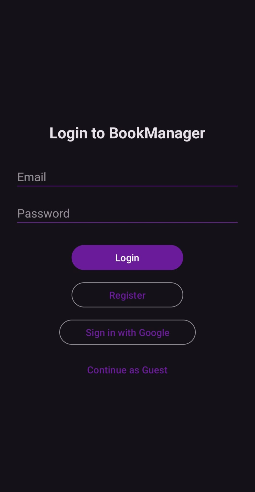
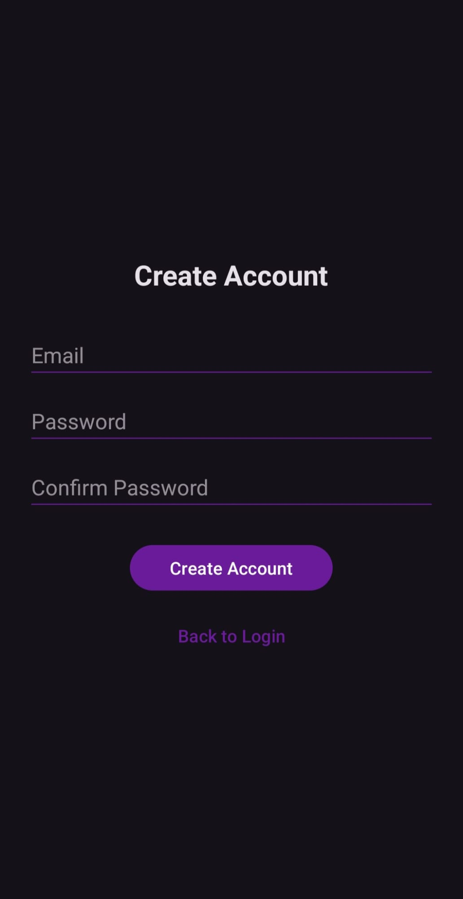
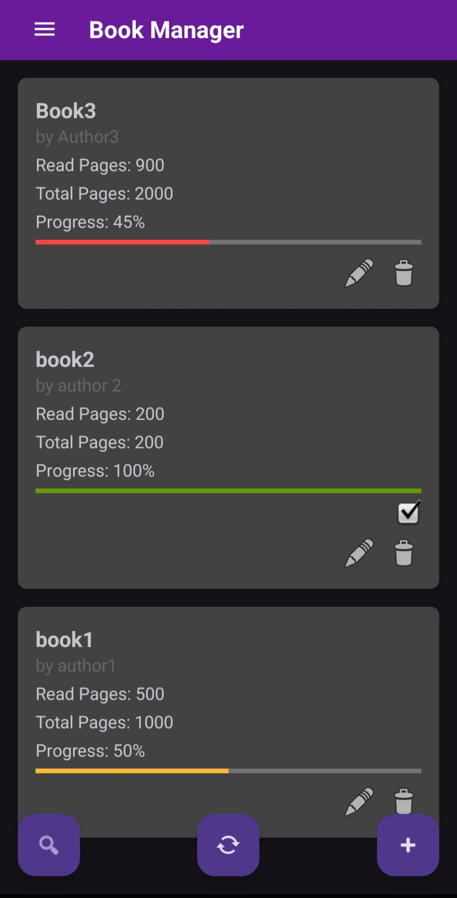
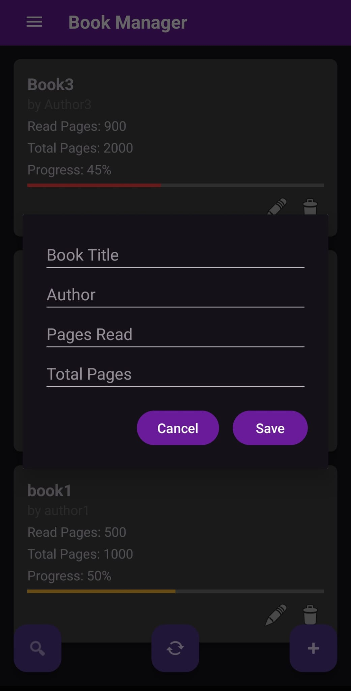

# BookManager

A simple Android app to track your reading list. Add books, update reading progress, filter and search, and optionally sign in to sync. This is a **student project built for educational purposes only** and not intended for commercial use.

    

## Features

-   Email and Google sign in, plus guest mode
    
-   Create, edit, and delete books
    
-   Track pages read and total pages with live progress bars
    
-   Mark books complete when progress hits 100%
    
-   Filter and search books
    
-   Local persistence with Room
    
-   Optional cloud sync using Firestore
    
-   Clean Material UI

## Screenshots

### Authentication

| Login | Create Account |
|-------|----------------|
|  |  |

### Main App

| Home | Add / Edit Book |
|------|-----------------|
|  |  |

## Tech Stack

-   **Language:** Kotlin
    
-   **Architecture:** MVVM, Repository pattern
    
-   **Local data:** Room (DAO pattern)
    
-   **Remote data:** Firebase Firestore
    
-   **Authentication:** Firebase Authentication (Email/Password & Google Sign-In)
    
-   **UI:** RecyclerView, Fragments, DialogFragment, Material Components
    
-   **Concurrency:** Kotlin Coroutines, Flow/LiveData
    
-   **Preferences:** DataStore for filters

## Project Structure
com.example.bookManager
│
├─ auth.presentation
│  ├─ LauncherActivity
│  ├─ LoginActivity
│  └─ RegisterActivity
│
├─ core
│  ├─ data
│  │  ├─ local
│  │  │  ├─ BookDao
│  │  │  ├─ DeletedBookDao
│  │  │  └─ BookDatabase
│  │  └─ remote
│  │     └─ FirestoreBookDataSource
│  ├─ repo
│  │  ├─ BookRepository
│  │  └─ BookRepositoryImpl
│  ├─ model
│  │  ├─ Book
│  │  └─ DeletedBook
│  └─ util
│     └─ FilterPreferences
│
├─ feature
│  ├─ bookedit.presentation
│  │  └─ AddEditBookDialogFragment
│  ├─ books.presentation
│  │  ├─ BookAdapter
│  │  └─ BookViewModel
│  └─ filters.presentation
│     └─ FilterDialogFragment
│
└─ MainActivity

## Getting Started

### Prerequisites

-   Android Studio Hedgehog or newer
    
-   JDK 17
    
-   Android 8.0+ device or emulator
    
-   Firebase project (for Auth & Sync)
    

### Setup

1.  Clone the repo
git clone https://github.com/AnasAlhatti/BookManager.git
cd BookManager
2. Open in Android Studio and let Gradle sync.
    
3.  **Optional (Firebase integration):**
    
    -   Add `google-services.json` to `/app`
        
    -   Enable Email/Password & Google sign-in in Firebase Authentication
        
    -   Enable Cloud Firestore
        
4.  Run on an emulator or physical device.
    

### Local-only mode
If Firebase isn’t configured, the app works offline with Room storage only.

## How It Works

-   **MVVM** separates UI from logic (`BookViewModel` ↔ `BookRepository`)
    
-   **Repository** merges local (Room) and remote (Firestore) data
    
-   **Room** stores books & deleted books locally
    
-   **FirestoreBookDataSource** syncs data when authenticated
    
-   **FilterPreferences** handles user filter/sort settings
    

----------

## Roadmap

-   Undo delete with Snackbar
    
-   Sorting options (title, progress, etc.)
    
-   Import/export as JSON
    
-   Theme toggle (dark/light)
    

----------

## Educational Disclaimer

This project is for **learning and portfolio purposes only**.  
Not licensed for commercial use. Do not use, copy, or distribute for business purposes.

